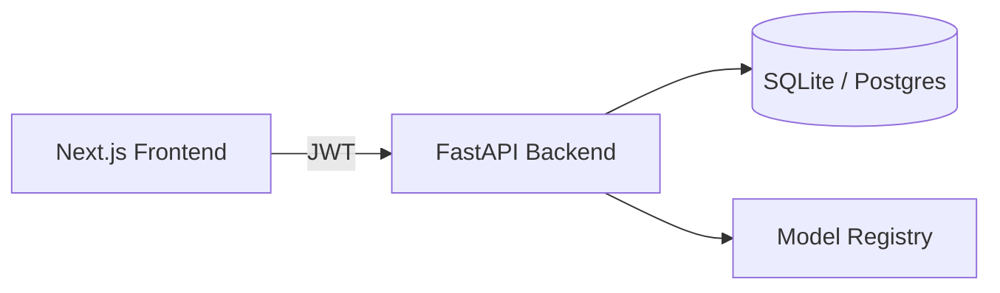

# EduPredict — AI Student Performance Predictor

EduPredict is a web app that predicts whether a student is **At-Risk** or **Not-At-Risk** based on academic signals (attendance, assignments, quizzes, exams, GPA), with role-based dashboards for **Admins**, **Teachers**, and **Students**.

## Tech stack

- **Frontend:** Next.js (App Router) + TypeScript + Tailwind CSS v4
- **Backend:** FastAPI (async) + SQLAlchemy (async) + Alembic + JWT auth + RBAC
- **Database:** SQLite by default for local dev (Postgres supported via Docker)

## Repository layout

- `apps/frontend` — Next.js app (UI)
- `apps/backend` — FastAPI app (API + ML endpoints)

## Run locally (Windows-friendly)

### 1) Backend (FastAPI)

- Ensure `apps/backend/.env` exists (see `apps/backend/.env.example`).

Install deps (from repo root):

```bash
python -m pip install -e apps/backend
```

Start the API (run from `apps/backend` so imports resolve cleanly):

```bash
cd apps/backend
python -m uvicorn app.main:app --reload --host 127.0.0.1 --port 8000
```

OpenAPI docs:
- `http://127.0.0.1:8000/docs`

Health check:
- `http://127.0.0.1:8000/health`

### 2) Frontend (Next.js)

- Ensure `apps/frontend/.env.local` exists (see `apps/frontend/.env.example`).
  - `NEXT_PUBLIC_API_BASE_URL` should point to the backend, e.g. `http://127.0.0.1:8000`.

Install deps:

```bash
npm --prefix apps/frontend install
```

Start the dev server (defaults to `http://127.0.0.1:3000`):

```bash
npm --prefix apps/frontend run dev
```

### 3) Production build (frontend)

If a production build ever errors with a missing page module on Windows, run a clean build:

```bash
npm --prefix apps/frontend run build:clean
```

## Optional: Postgres via Docker

This repo includes `docker-compose.yml` to run Postgres locally. To use it:

1. Start Postgres.
2. Set `DATABASE_URL` in `apps/backend/.env` to the Postgres URL shown in `apps/backend/.env.example`.

## Free deployment (recommended)

This project can be deployed end-to-end on free tiers without rewriting the backend:

- **Frontend:** Cloudflare Pages (deploy `apps/frontend`)
- **Backend:** Hugging Face Spaces (Docker Space; deploy `apps/backend`)
- **Database:** Managed Postgres (Supabase or Neon free tier)

### High-level steps

1. Create a Postgres database (Supabase/Neon) and copy its connection string.
2. Deploy the backend to Hugging Face Spaces.
  - See `apps/backend/README_DEPLOY.md`.
  - Set `DATABASE_URL`, JWT settings, and `CORS_ALLOW_ORIGINS` in the Space settings.
  - Run Alembic migrations against the production DB.
3. Deploy the frontend to Cloudflare Pages.
  - See `apps/frontend/README_DEPLOY.md`.
  - Set `NEXT_PUBLIC_API_BASE_URL` to your deployed backend URL.

### Notes

- Cloudflare **Workers** run JavaScript/TypeScript, so the Python FastAPI+ML backend is not deployed on Workers in this setup.
- If you need Cloudflare-native DB + compute (Workers + D1), that requires a backend rewrite.

## Architecture (concept)


